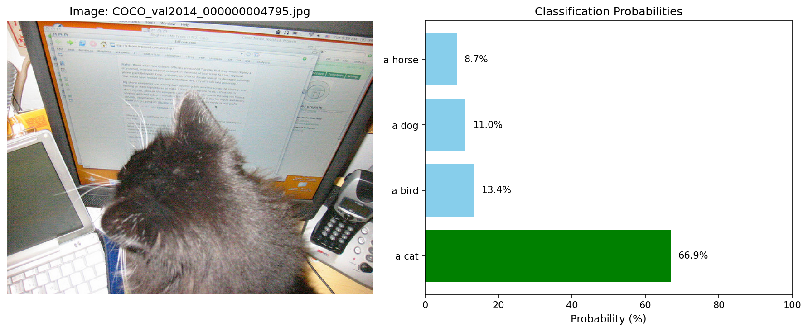
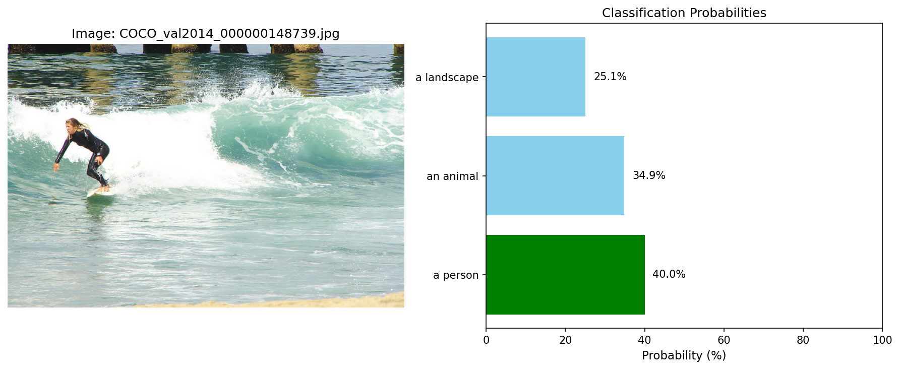
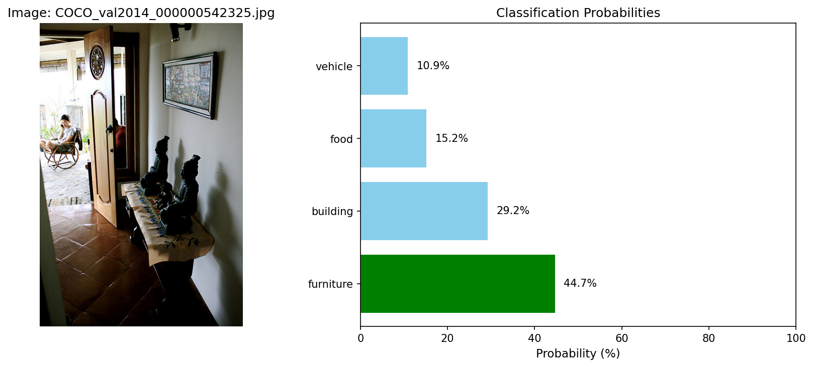
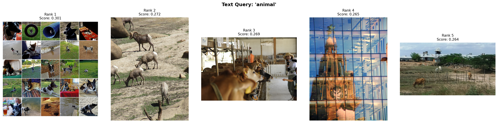
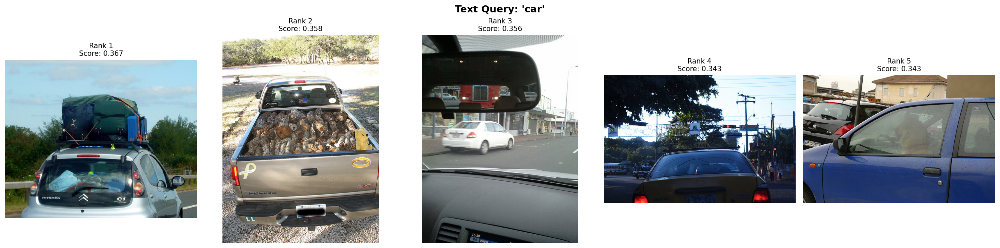
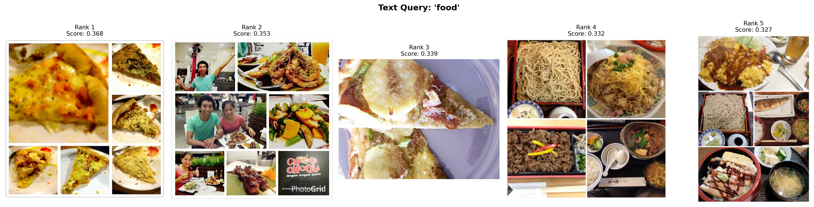
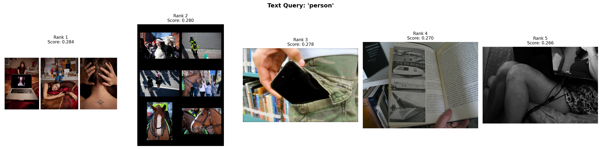
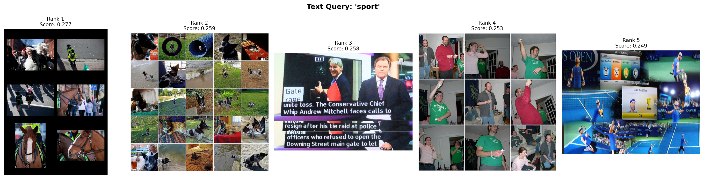

# Lab Summary and Results

This lab focused on fine-tuning the image encoder of a CLIP-like model, utilizing a ResNet50 backbone, for improved image-to-text retrieval and zero-shot image classification. The project processes the COCO 2014 dataset, caching text embeddings to efficiently train the image encoder to align visual and textual representations.

## Evaluation Results

Here are some visual results from the evaluation of the fine-tuned model:

### Classification Examples

### Retrieval Examples

